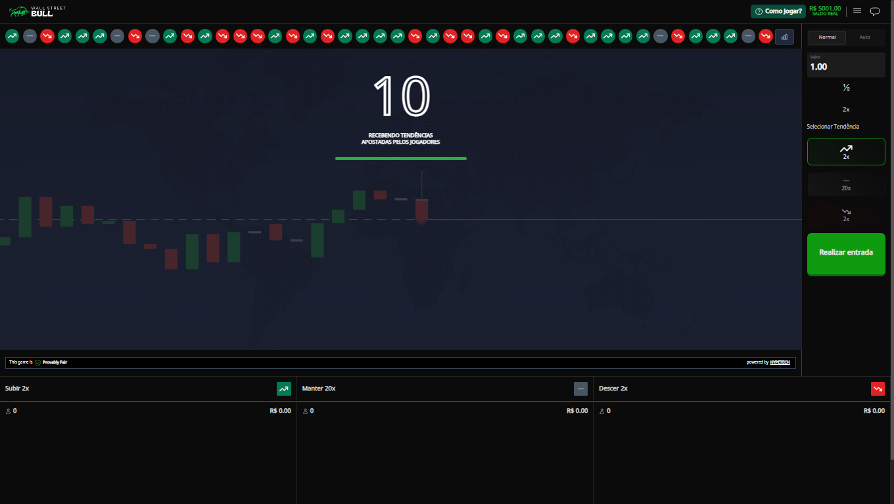
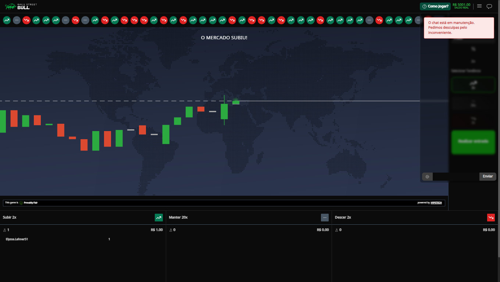
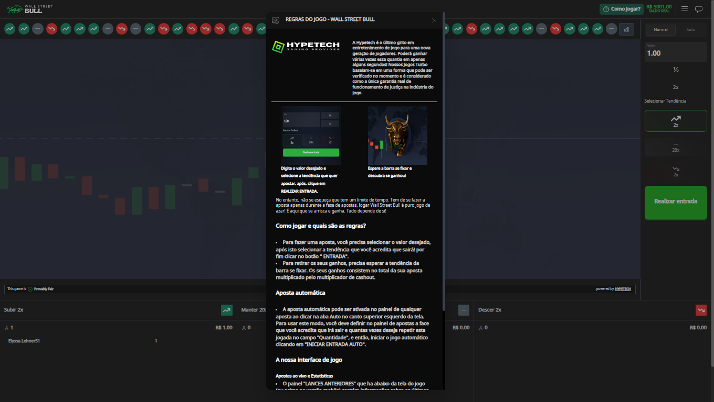
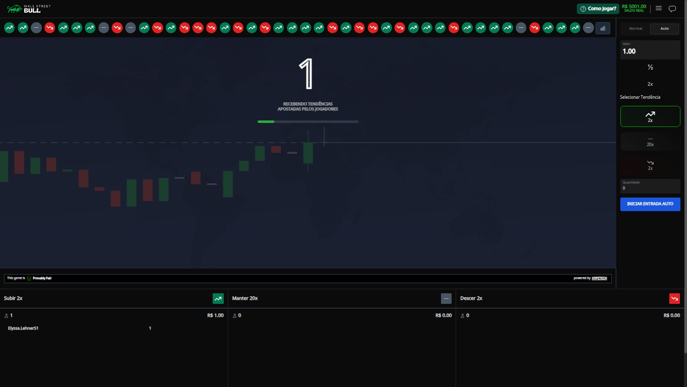

# 📚 Desafio Hypetech Games

# 🎯 Objetivo:

Deve ser feito uma refatoração da interface de usuário atual, para uma nova interface utilizando ReactJS e tailwindcss.

# 🖥️ Tecnologias utilizadas:

## 📋 Pré-requisitos:

- React 18.2 ou Superior
- Tailwindcss 4.14 ou Superior

# 🛠️ Como Utilizar:

1. Clone o repositório para sua máquina utilizando o comando:
   `git clone git@github.com:iamlucasgomes/wallstreet-game.git`
2. Após finalizar o download, acesse https://hypetech-demo-api-service-developer.up.railway.app/docs/ e gere um novo token
   Obs: deve ser alterado os parametros no swagger para estes <code>"game": "wall-street",
   "lang": "pt",
   "currency": "BRL" </code>
3. Abra um terminal na **pasta raiz do repositório** e execute o comando <code>yarn start</code>;
4. Aguarde a inicialização ser concluída;
5. Após isso, você poderá acessar o frontend da aplicação localmente através do localhost na porta 8000. Por padrão, a página pode ser acessada nesse link: <link>http://localhost:8000/seutoken</link>

## 📸 Preview:

#### Tela de início

#### Tela de inicio com menu aberto

#### Tela com chat aberto

#### Tela como jogar

#### Tela com Auto

